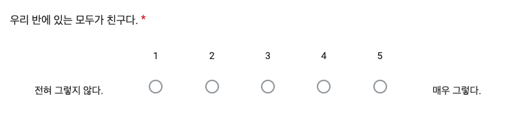
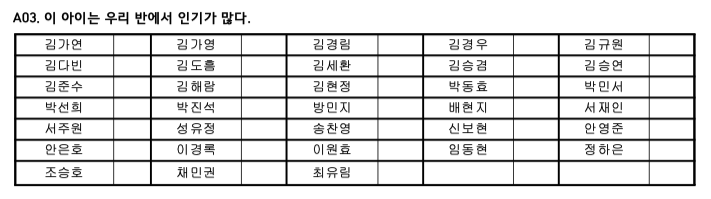
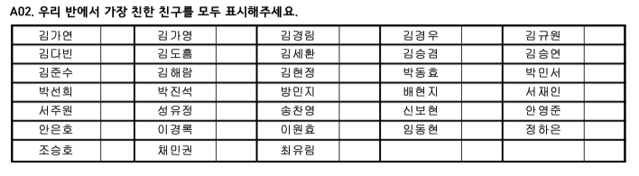
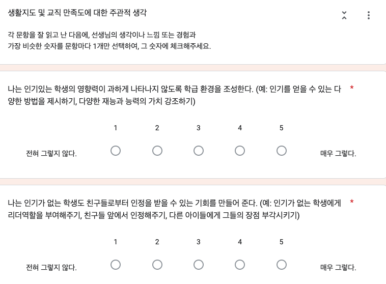
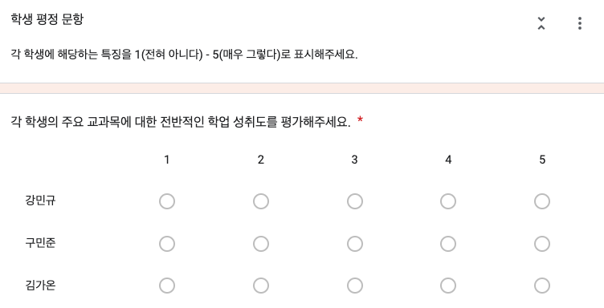

# Monitoring System 구성안

척도 구성

대분류

- 인구학적 정보
- 또래지위와 사회적 행동
- 또래괴롭힘과 개인심리적 특성
- 학업적 적응
- 사회적 관계
- 학급분위기
- 교사의 생활지도 역량
- 종단적 변화

세부 구성 (척도, 문항, 측정방식, 참고문헌)

인구학적 정보

지역, 학교, 학급, 학년, 반, 번호, 성별 

사회적 적응

|  | 척도 | 문항 | 측정방식 | 문항수 | 참고문헌 | 비고 | 인포그램 페이지 |
| --- | --- | --- | --- | --- | --- | --- | --- |
| 또래지위 | 지각된 인기 | PN1. 가장 인기가 있는 | 또래지명 | 1 |  |  | 1 |
|  | 사회적 선호 | PN2. 가장 같이 놀고 싶은
PN3. 가장 같이 놀기 싫은 | 또래지명 | 2 |  | 학부모상담 | 1 |
| 사회적 행동 | 외현적 공격성 | PN4. 문제를 일으키는/학교의 규칙을 지키지 않는
PN5. 싸움을 하는 | 또래지명 | 2 |  |  | 1 |
|  | 관계적 공격성 | PN6. 험담을 하거나 다른 친구를 소외시키는
PN7. 나쁜 소문을 퍼뜨리는 | 또래지명 | 2 |  |  | 1 |
|  | 친사회성 | PN8. 친절한
PN9. 협력적인 | 또래지명 | 2 |  |  | 1 |
|  | 인기동기 | SR1. 나는 인기있는 아이와 친구가 되고 싶다.                   SR2. 나는 인기있는 무리에 속하고 싶다.                          SR3. 나는 인기있는 사람이 되고 싶다.                             SR4. 나는 인기없는 아이와는 친구가 되고 싶지 않다.           SR5. 나는 인기없는 무리에 속하고 싶지 않다.                  SR6. 나는 인기없는 사람이 되고 싶지 않다.                       (SR1-3: 인기추구, SR4-6: 인기상실불안) | 자기보고 (리커트 척도) | 6 |  |  | 1 |
| 또래괴롭힘의 집단역동 | 또래괴롭힘 가해 | PN10. 친구를 괴롭히는 행동을 시작하는
PN11. 괴롭힘에 다른 사람을 참여하도록 하는 | 또래지명 | 2 |  |  | 2 |
|  | 또래괴롭힘 피해 | PN12. 다른 아이들에게 자주 놀림을 받는
PN13. 다른 아이들에게 맞거나 욕설을 듣는 | 또래지명 | 2 |  |  | 2 |
| 사회정서역량 | 공감 | SR7. 나는 학교에서 나보다 어려운 친구를 보면 걱정되고 마음이 아프다.
SR8***. 가끔은 다른 사람이 어려움을 겪고 있더라도, 나는 그렇게 안타까움이나 미안함을 느끼지 않는다.**
SR9. 다른 사람을 이용하는 학생과는 친구가 되고 싶지 않다.
SR10***. 다른 사람의 불행은 나와는 크게 상관이 없는 일이다.
SR11*. 다른 사람이 불공평한 일을 겪어도 나와 관련 없으면 상관없다.**
SR12. 나는 종종 내가 본 일에 대해 감동받는다.
SR13. 나는 스스로를 마음이 고운 사람이라고 말할 수 있다.
SR14. 내 생각을 정하기 전에 나와 생각이 다른 친구의 의견을 들어보려고 한다.
SR15***. 나는 다른 사람의 입장에서 생각하는 것이 어렵다.**
SR16. 친구를 욕하기 전에, 그 친구 입장에서 생각해본다.
SR17. 나는 친구들을 더 이해하기 위해서, 친구들의 입장에서 나의 모습이 어떻게 보일지 상상해본다.
SR18***. 내가 맞다고 생각되면, 다른 사람의 의견을 듣지 않는다.**
SR19. 모든 질문은 하나 이상의 답이 있다고 생각하고, 여러 가지 생각을 해본다.
SR20. 화가 났을 때 바로 화내지 않으려 노력한다.                    (*표시된 문항은 역산, 인지적 공감 SR 7 - 13, 정서적 공감 SR 14 - 20) | 자기보고 (리커트 척도) | 14 |  Davis, M. H. (1983). Measuring individual differences in empathy: Evidence for a multidimensional approach. Journal of Personality and Social Psychology, 44(1), 113–126. | 학부모상담 | 2 |
| 정신건강 | 내재화(우울) | SR21. 평상시에는 아무렇지도 않던 일들이 귀찮게 느껴졌다.
SR22. 무슨 일을 하든 정신을 집중하기가 힘들었다.
SR23. 우울했다.
SR24. 하는 일마다 힘들게 느껴졌다.
SR2**5*. 앞으로 잘 될 것이라고 느꼈다.**
SR26. 두려움을 느꼈다.
SR27. 잠을 설쳤다, 잠을 잘 이루지 못했다.
SR28***. 행복했다.**
SR29. 세상에 홀로 있는 듯 한 외로움을 느꼈다.
SR30. 도무지 무엇을 시작할 기운이 나지 않았다.                (*표시된 문항은 역산)  | 자기보고 (리커트 척도) | 10 | 안정숙, 전성균, 한준규, 노경선, Robert Goodman(2003). 한국어판 강점·난점 설문지 (Strengths and Difficulties Questionnaire) 개발. J Korean Neuropsychiatr Assoc 42(1), 141-147. | 학부모상담 | 2 |
| 학급맥락 | 또래공동체 의식 | SR31. 우리반 친구들은 서로 잘 도와준다.
SR32. 우리 선생님과 반 친구들은 서로를 존중하고 배려한다.
SR33. 우리 반 친구들은 서로 잘 챙겨준다.
SR34. 우리 반 친구들은 서로에게 잘 해준다.

 | 자기보고 (리커트 척도) | 4 | Gest, S. D., Welsh, J. A., & Domitrovich, C. E. (2005). Behavioral predictors of changes in social relatedness and liking school in elementary school. Journal of school psychology, 43(4), 281-301. | 학부모상담 | 6 |

학업적 적응

| 척도 | 문항 | 측정방식 | 문항수 | 참고문헌 | 비고 | 인포그램 페이지 |
| --- | --- | --- | --- | --- | --- | --- |
| 수업참여 | SR35. 나는 학교에서 잘하려고 노력한다.
SR36. 나는 수업 시간에 최대한 열심히 한다.
SR37. 나는 수업에서 하는 토론에 참여한다. 
SR38. 나는 수업에 집중한다.
SR39. 나는 수업을 주의 깊게 듣는다.
SR40. 나는 수업 시간에 기분이 좋다.
SR41. 나는 수업에서 무언가를 할 때 흥미를 느낀다.
SR42. 수업은 재미있다.
SR43. 나는 수업에서 새로운 것을 배우는 것을 즐긴다.
SR44. 나는 수업활동에 적극적으로 참여한다.                           (SR 35 - 39: 행동적 참여 , SR 40 -44: 정서적 참여 ) | 자기보고 (리커트 척도) | 10 | Skinner, E. A., Kindermann, T. A., & Furrer, C. J. (2009). A motivational perspective on engagement and disaffection: Conceptualization and assessment of children's behavioral and emotional participation in academic activities in the classroom. *Educational and psychological measurement*, *69*(3), 493-525. | 학부모상담 | 3 |
| 사회적 상호의존성 | SR45. 나는 다른 학생의 학습을 도와주는게 좋다.
SR46. 나는 내 생각이나 준비물을 다른 학생과 공유하는 것을 좋아한다.
SR47. 나는 다른 학생과 협동하는 것을 좋아한다.
SR48. 나는 다른 학생들에게 중요한 것들을 배울 수 있다.
SR49. 모둠 학습에서 내 생각과 준비물을 나누려고 노력한다.
SR50. 학생들은 서로서로 가르쳐주고 배울 수 있다.
SR51. 학습할 때 학생끼리 서로 돕는 것이 좋다고 생각한다.   SR52. 나는 다른 학생보다 더 잘하고 싶다.
SR53. 나는 내가 다른 학생보다 더 좋은 점수를 받기 위해서 공부한다.
SR54. 나는 우리 반에서 최고의 학생이 되고 싶다.
SR55. 나는 남에게 뒤쳐지는 것을 좋아하지 않는다.
SR56. 나는 누가 최고인지 알아보기 위해서 다른 학생과 경쟁(승부를 겨루는 것)하는 것을 좋아한다.
SR57. 나는 다른 학생과 경쟁(승부를 겨루는 것)할 때 가장 행복하다.
SR58. 나는 누가 최고인지 알아보기 위해 도전하는 것을 좋아한다.
SR59. 다른 학생과의 경쟁은 공부하기 위한 좋은 방법이다.       (SR 45 - 51: 협동적 태도, SR 52 - 59: 경쟁적 태도)     | 자기보고 (리커트 척도) | 22 | Johnson, D. W., & Norem-Hebeisen, A. A. (1979). A measure of cooperative, competitive, and individualistic attitudes. The Journal of Social Psychology, 109(2), 253-261. | 학부모상담 | 3 |
| 교사평정 성취도 | TR1. 각 학생의 주요과목에 대한 성취도를 평가해주세요.  | 자기보고 (리커트 척도) |  |  |  | 3 |

사회적 관계

|  | 척도 | 문항 | 측정방식 | 문항수 | 참고문헌 | 비고 | 인포그램 페이지 |
| --- | --- | --- | --- | --- | --- | --- | --- |
| 또래네트워크 | 친한친구 | PN14.가장 친한 친구는?  | 또래지명 | 1 |  | 학부모상담 | 4 (지명 받은 수) & 5 (네트워크 그림) |
|  | 학습친구 | PN15.같이 공부하는 친구는? | 또래지명 | 1 |  | 학부모상담 | 4 (지명 받은 수) & 5 (네트워크 그림) |
|  | 협동학습 친구 | PN16.공부할 때 도움을 요청하는 친구는? | 또래지명 | 1 |  | 학부모상담 | 4 (지명 받은 수) & 5 (네트워크 그림) |
|  | 선망하는 친구 | PN17.함께 어울리거나, 친구가 되고싶은 사람은? | 또래지명 | 1 |  | 학부모상담 | 4 (지명 받은 수) & 5 (네트워크 그림) |
| 교사-학생관계 | 교사선호 | PN18.선생님과 잘 지내는 | 또래지명 | 1 |  |  | 4 (지명 받은 수) & 5 (네트워크 그림) |
|  | 교사비선호 | PN19.선생님과 잘 지내지 못하는 | 또래지명 | 1 |  |  | 4 (지명 받은 수) & 5 (네트워크 그림) |
| 부모-자녀관계 | 양육태도 | SR60. 부모님은 내가 하고 있는 일들을 중요하게 생각해준다.
SR61. 부모님은 내가 착하게 행동하면 칭찬해준다.
SR62. 부모님은 내가 겁을 내거나 당황할 때, 도와주려고 하신다.
SR63. 부모님은 내가 칭찬받을 일을 하면 칭찬해주신다.
SR64. 부모님은 내가 소중하고 필요한 존재라는 것을 느끼도록 해준다.
SR65. 부모님은 나의 생각들을 존중하고, 내 생각을 표현하도록 북돋아준다.
SR66. 부모님은 일상생활에 관해 나와 같이 이야기하고, 이야기도 들어주신다.
SR67. 부모님은 내가 무언가를 잘했을 때, 나 스스로 자랑스럽게 느끼도록 해준다.
SR68. 부모님은 내가 친구들을 집에 데리고 오는 걸 좋아하고, 친구들에게도 잘해주신다.
SR69. 부모님은 나에게 짜증을 낸다.
SR70. 부모님은 나를 거칠게 대한다.
SR72. 부모님은 내가 잘못하면 바로 혼내신다.
SR72. 부모님은 내가 자신을 신경쓰이게 한다고 말하신다.
SR73. 부모님은 나의 기분을 상하게 한다.
SR74. 부모님은 내가 잘못을 저지를 경우, 윽박지르거나 위협적으로 대한다.
SR75. 부모님은 화가 났을 때 나를 심하게 혼낸다.                                                        (SR 60-68: 애정, SR 69-75: 거부)                    | 자기보고 (리커트 척도) | 16 | 백승진(2008). 대학생이 지각한 부모의 양육태도와 자기명확성의 관계. 숙명여자대학교 대학원 국내석사학위논문. | 학부모상담, 주관식 포함? | 4 (평균점수) |

학급맥락

| 척도 | 계산방식 | Item No | 비고 | 인포그램 페이지 |
| --- | --- | --- | --- | --- |
| 또래공동체 의식 | 또래공동체 의식 개인 점수의 학급평균 | SR 31-34 |  | 6 |
| 밀도 | Rsna 패키지를 활용해서, 친구관계 행렬의 밀도를 계산 (친구지명수/최대로 가능한 지명수) | PN 14 | 주영 for more information.  | 6 |
| 집중화도 | Rsna 패키지를 활용해서, 친구관계 행렬의 집중화도를 계산 (친구관계 지명의 표준편차계산) | PN 14 | 주영 for more information.  | 6 |
| 공격성 규범 | 또래지명으로 측정된 공격성*친구관계 가중치의 학급평균치 | PN 4-7 & PN 14 |  | 6 |
| 친사회성 규범 | 또래지명으로 측정된 친사회성*친구관계 가중치의 학급평균치 | PN 8 -9 & PN 14 |  | 6 |

교사역량

| 척도 | 문항 | 측정방식 | 참고문헌 | 비고 | 인포그램 페이지 7 |
| --- | --- | --- | --- | --- | --- |
| 사회적 역동 관리 | TSR1. 나는 인기있는 학생의 영향력이 과하게 나타나지 않도록 학급 환경을 조성한다. ( 예: 인기를 얻을 수 있는 다양한 방법을 제시하기, 다양한 재능과 능력의 가치 강조하기)
TSR2. 나는 인기가 없는 학생도 친구들로부터 인정을 받을 수 있는 기회를 만들어 준다. (예: 인기가 없는 학생에게 리더역할을 부여해주기, 친구들 앞에서 인정해주기, 다른 아이들에게 그들의 장점 부각시키기)
TSR3. 나는 인기가 없는 학생들에게 친구들로부터 인기를 얻고 인정받을 수 있는 사회적 기술과 전략을 알려주려고 노력한다.
TSR4. 나는 인기가 없는 학생들을 위해 학급에서 친구들과 함께 사이좋게 지내는 것의 중요성을 강조한다.
TSR5. 나는 인기가 없는 학생을 위해, 인기있는 학생과 짝궁을 맺어주거나, 다른 친구들과 함께 공부할 수 있는 기회를 제공한다.
TSR6. 나는 학급에서 또래들간의 인기의 균형을 이루도록 노력한다. (예: 다양한 학생에게 리더 역할 부여하기, 인기학생들도 다른 학생들의 안내와 지시에 따르는 기회 주기, 자리배치와 모둠과제를 활용하여 소수의 학생이 학급 분위기를 주도하지 않도록 유도하기)
TSR7. 나는 학급에서 소외받고 친구가 없는 학생들이 친구를 사귈 수 있는 기회를 제공하려고 노력한다. (예: 해당 학생이 좋아하는 자리나 모둠을 선택하도록 함)
TSR8. 나는 학급에서 소외받고 친구가 없는 학생들이 선호하는 또래와 친구가 될 수있도록 도와준다. (예: 소외 받은 학생이 선호하는 특정 학생(혹은 그들과 짝이 되는 것에 거부감을 가지지 않는 학생)과 짝을 지어주거나, 모둠이 되도록 함.)
TSR9. 나는 학급에서 다양한 친구를 사귀는 것의 중요성을 강조하여, 소외받고 친구가 없는 학생을 보호하려고 노력한다.
TSR10. 나는 학급에서 소외받고 친구가 없는 학생들이 친구를 사귀는 사회적 기술과 전략을 개발하고 연습할 수 있도록 지도한다.
TSR11. 나는 문제를 일으키는 또래관계나 또래집단이 다른 친구들과 어울릴 수 있도록 학급의 환경을 조성한다. (예: 자리 배치나 모둠학습을 통해 긍정적인 또래관계 혹은 문제를 일으키는 또래를 떨어뜨려 놓음)
TSR12. 나는 특정한 또래집단에서의 부정적인 또래 상호작용을 최소화 하고, 긍정적인 또래관계를 형성할 수 있도록 돕는다. (예: 친사회적 행동을 강화하거나, 문제행동을 줄일 수 있는 방법을 안내함.)
TSR13. 나는 문제를 일으키는 또래들과 어울리는 학생이 학급에서 다른 친구들과 우정을 형성할 수 있도록 돕는다.
TSR14. 나는 학생들의 폭력 행동 또는 또래를 괴롭히는 행동을 최소화 할 수 있도록 학급 환경을 조성한다. (예: 수업시간에 학생들을 과제에 집중시키기, 또래를 괴롭히는 학생들을 서로 떨어뜨려 놓기, 또래를 괴롭히는 학생들을 교사 가까이 두고 지켜보기)
TSR15. 나는 학생들이 폭력 행동 또는 또래를 괴롭히는 행동을 할 경우 꼭 따로 불러 잘못된 행동에 대해 설명하고 주의를 준다.
TSR16. 나는 또래로부터 괴롭힘을 당하는 학생들이 계속 괴롭힘을 당하지 않도록 노력한다. (예: 괴롭히는 친구와 짝이 되지 않도록 하기, 어른의 감독이 없는 상황에 혼자 있지 않도록 하기)
TSR17. 나는 학생이 또래로부터 괴롭힘을 당하는 것을 발견하면 바로 개입하여 피해를 줄일 수 있도록 노력한다.
TSR18. 나는 또래로부터 괴롭힘을 당하는 학생에게 괴롭힘에 효과적으로 대처하고 괴롭힘을 피할 수 있는 방법을 알려주려고 노력한다.
TSR19. 나는 폭력 행동 또는 또래를 괴롭히는 행동을 하는 학생들에게 바람직한 행동을 하는 학생과 어울릴 수 있는 기회를 주어 이들로부터 좋은 영향을 받을 수 있도록 노력한다. (예: 또래를 잘 도와주는 학생과 짝이 되어 앉게 하기)
TSR20. 나는 폭력 행동 또는 **또래를 괴롭히는 행동을 하는 학생들(가해학생)**에게 학급의 임무를 맡겨 다른 학생들과 잘 어울릴 수 있는 기회를 주려고 노력한다. (예: 특정 임무를 부여하기, 또래에게 좋은 인상을 줄 수 있는 기회 만들어주기)
TSR21. 나는 폭력 행동 또는 또래를 괴롭히는 행동을 하는 학생들이 바람직한 행동을 배울 수 있도록 돕는다. (예: 친구들과 잘 어울릴 수 있는 방법을 가르쳐주기, 또래에게 친절한 행동을 할 때마다 칭찬하기)
TSR22. 나는 **또래 괴롭힘을 당하는 학생(피해학생)**들에게 또래들이 긍정적으로 평가할만한 학급의 임무를 만들고, 수행하도록 하여 다른 학생들과 잘 어울릴 수 있는 기회를 주려고 노력한다. (예: 특정 임무를 부여하기, 또래에게 좋은 인상을 줄 수 있는 기회 만들어주기 )
TSR23. 나는 또래로부터 괴롭힘을 당하는 학생들이 다른 또래들과 어울릴 수 있는 기회를 만들어주려고 노력한다. (예: 또래를 도와주는 학생과 짝이 되어 앉게 하기)                                                                                                        (TSR 1-6: 학생의 평등한 지위관리 , TSR 7-10: 소외 학생관리 , TSR 11-13: 문제행동 관리 , TSR 14-18: 공격성 관리 , TSR 19- 23: 긍정적 학급 분위기 조성   )  | 자기보고 (리커트 척도) | Braun, S.S., Zadzora, K.M., Miller, A.M. et al. Predicting elementary teachers’ efforts to manage social dynamics from classroom composition, teacher characteristics, and the early year peer ecology. Soc Psychol Educ 22, 795–817 (2019). | 학교수준 리포트, 교사 평균값 제공 | 7 |
| **또래관계 교사 민감성** | TR2. 이 아이는 반 아이들 사이에서 인기가 있다.
TR3. 반 아이들은 이 아이와 함께 놀고 싶어한다.
TR4. 이 아이는 친구들과 싸움을 시작하는 편이다.                                                                                   TR5. 이 아이는 험담을 하거나 다른 친구를 소외시킨다.
TR6. 이 아이는 친구를 괴롭히는 행동을 시작한다.  
TR7. 이 아이는 친구들에게 자주 놀림을 당한다.                                                                                  TR8. 이 아이는 친절하다.
TR9. 이 아이는 학교에서 잘하려고 노력한다.
TR10. 이 아이는 수업 시간에 기분이 좋아 보인다. | **학생평정 후 또래지명 점수와의 상관을 통해 산출 (리커트 척도)** |  |  | 7 |

측정방식분류 및 유의사항

- 학생 자기보고 (SR 1- 67)

 질문에 대한 응답을 학생 개개인이 5점 리커트 척도 [전혀 그렇지 않다 (1점) - 매우 그렇다 (5점)] 응답하는 측정방식으로, 개인내적 심리 및 학급의 특성에 대한 자신의 지각을 보고함

예시1.  또래공동체 의식

학생자기보고 데이터 구조

| Student ID | SR1 | SR2 | SR3 | SR4 |
| --- | --- | --- | --- | --- |
| 10301 | 4 | 4 | 5 | 3 |
| 10302 | 3 | 3 | 4 | 4 |

- 학생 또래지명 (PN 1- 13 & 18-19: 평판 및 비율점수 / PN14 - 17: 또래관계 및 행렬)

문항에 제시된 특징에 해당하는 친구를 자신을 제외하고 모두 선택하는 측정방식으로, 개별학생에 대해 또래들이 가지고 있는 지각/평판이나 또래네트워크를 보고함. 

**주의사항: 설문대상자를 제외한 나머지 친구들만 선택지에 나오도록 설문 시스템 구성 필요 (자기 지명을 소프트웨어적으로 예방하기)**

예시 1. 지각된 인기 (평판, 비율점수) PN1

또래지명 데이터 구조 : 평판/비율점수의 경우 (예시: 지각된 인기- PN1)

1. 행렬데이터 구성 

|  | 김가연 | 김가영 | 김경림 | 김경우 | 김규원 |
| --- | --- | --- | --- | --- | --- |
| 김가연 |  | 1 | 1 | 1 | 1 |
| 김가영 | 1 |  | 1 |  |  |
| 김경림 | 1 | 1 |  |  |  |
| 김경우 | 1 |  | 1 |  |  |
| 김규원 | 1 |  | 1 | 1 |  |
1. 비율점수 데이터로 재구성 

|  | PN1 (지각된 인기) | 산출방식 |
| --- | --- | --- |
| 김가연 | 1  | 4/4 =1 (친구로 지명받은수/ 지명이 가능한 수 - 전체 샘플수 -1) |
| 김가영 | .5 | 2/4 |
| 김경림 | 1 | 4/4 |
| 김경우 | .5 | 2/4 |
| 김규원 | .25 | 1/4 |

예시 2. 친구네트워크 (관계, 행렬을 사용) 

또래지명 데이터 구조 : 또래관계의 경우 (예시: 친구 네트워크)

|  | 김가연 | 김가영 | 김경림 | 김경우 | 김규원 |
| --- | --- | --- | --- | --- | --- |
| 김가연 |  | 1 | 1 | 1 | 1 |
| 김가영 | 1 |  | 1 |  |  |
| 김경림 | 1 | 1 |  |  |  |
| 김경우 | 1 |  | 1 |  |  |
| 김규원 | 1 |  | 1 | 1 |  |

행렬데이터를 사용. 이때, 행은 지명을 하는 사람, 열을 지명받는 사람을 의미하며, 지명을 하는 경우에는 1로, 지명하지 않는 경우는 0으로 표시한다. 스스로를 지명하는 경우는 오류값으로 처리하며, 설문단계에서 시스템적으로 제외하도록 한다. 지명하는 사람과 받는 사람을 고려하여, 서로의 관계가 양방향적 관계인지, 혹은 단방향인지, 관계가 존재하지 않는 지를 Sociogram으로 표시하도록 한다. 

예시데이터에서 김가연 학생은 김가영, 김경림, 김경우, 김규원 학생을 친구로 지명하였고, 다른 네명의 친구들도 동일하게 김가연 학생을 친구로 지명하였다. 이 경우 상호간의 양방향의 화살표로 친구관계로 표시한다. 한편, 김경림 학생은 김규원 학생을 친구로 지명하지 않았지만, 김규원학생은 김경림학생을 친구로 지명하였으며, 이 경우는 김규원 → 김경림으로 일방적으로 관계의 화살표가 가는 것으로 표시하도록 한다. 

- 교사 자기보고

예시: 사회적 역동관리 전략

 질문에 대한 응답을 교사 개인이 5점 리커트 척도 [전혀 그렇지 않다 (1점) - 매우 그렇다 (5점)] 응답하는 측정방식으로, 학급 생활지도에 대한 주관적인 인식을 보고함

교사 자기보고 데이터 구조

| Teacher ID | TSR1 | TSR2 | TSR3 | TSR4 | TSR5 |
| --- | --- | --- | --- | --- | --- |
| 10301 | 4 | 4 | 5 | 3 | 4 |

- 교사 학생평정

예시: 교사평정 학업성취

학생의 특성에 대해 교사가 개인이 5점 리커트 척도 [전혀 그렇지 않다 (1점) - 매우 그렇다 (5점)]로 평정하는 측정방식으로, 특성에 대한 또래의 생각과 교사의 생각을 비교해보기 위해 사용됨. 

| Student ID | TR1 | TR2 | TR3 | TR4 | TR5 |
| --- | --- | --- | --- | --- | --- |
| 10301 | 4 | 4 | 5 | 3 | 4 |
| 10302 | 5 | 4 | 3 | 4 | 3 |
| 10303 | 4 | 4 | 3 | 4 | 4 |
| 10304 | 3 | 4 | 4 | 3 | 3 |
| 10305 | 3 | 2 | 3 | 2 | 4 |